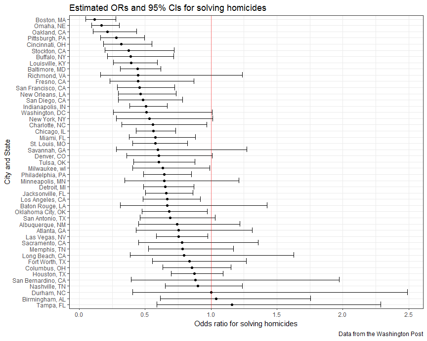

Homework 6
================

Problem 1
---------

### Import and manipulate data

``` r
homicide_df = 
  read_csv("./homicide-data.csv") %>% 
  mutate(city_state = str_c(city, ", ", state),
         resolved = as.numeric(disposition == "Closed by arrest")) %>% 
  filter(!(city_state %in% c("Dallas, TX", "Phoenix, AZ", 
                             "Kansas City, MO", "Tulsa, AL"))) %>% 
  mutate(victim_race = ifelse(victim_race != "White", "Non-White", "White"),
         victim_race = fct_relevel(victim_race, "White"),
         victim_age = as.numeric(victim_age)) %>% 
  select(city_state, resolved, everything())

homicide_df
```

    ## # A tibble: 48,507 x 14
    ##    city_state resolved uid   reported_date victim_last victim_first
    ##    <chr>         <dbl> <chr>         <int> <chr>       <chr>       
    ##  1 Albuquerq~        0 Alb-~      20100504 GARCIA      JUAN        
    ##  2 Albuquerq~        1 Alb-~      20100216 MONTOYA     CAMERON     
    ##  3 Albuquerq~        0 Alb-~      20100601 SATTERFIELD VIVIANA     
    ##  4 Albuquerq~        1 Alb-~      20100101 MENDIOLA    CARLOS      
    ##  5 Albuquerq~        0 Alb-~      20100102 MULA        VIVIAN      
    ##  6 Albuquerq~        0 Alb-~      20100126 BOOK        GERALDINE   
    ##  7 Albuquerq~        1 Alb-~      20100127 MALDONADO   DAVID       
    ##  8 Albuquerq~        1 Alb-~      20100127 MALDONADO   CONNIE      
    ##  9 Albuquerq~        0 Alb-~      20100130 MARTIN-LEY~ GUSTAVO     
    ## 10 Albuquerq~        0 Alb-~      20100210 HERRERA     ISRAEL      
    ## # ... with 48,497 more rows, and 8 more variables: victim_race <fct>,
    ## #   victim_age <dbl>, victim_sex <chr>, city <chr>, state <chr>,
    ## #   lat <dbl>, lon <dbl>, disposition <chr>

``` r
str(homicide_df)
```

    ## Classes 'tbl_df', 'tbl' and 'data.frame':    48507 obs. of  14 variables:
    ##  $ city_state   : chr  "Albuquerque, NM" "Albuquerque, NM" "Albuquerque, NM" "Albuquerque, NM" ...
    ##  $ resolved     : num  0 1 0 1 0 0 1 1 0 0 ...
    ##  $ uid          : chr  "Alb-000001" "Alb-000002" "Alb-000003" "Alb-000004" ...
    ##  $ reported_date: int  20100504 20100216 20100601 20100101 20100102 20100126 20100127 20100127 20100130 20100210 ...
    ##  $ victim_last  : chr  "GARCIA" "MONTOYA" "SATTERFIELD" "MENDIOLA" ...
    ##  $ victim_first : chr  "JUAN" "CAMERON" "VIVIANA" "CARLOS" ...
    ##  $ victim_race  : Factor w/ 2 levels "White","Non-White": 2 2 1 2 1 1 2 2 1 2 ...
    ##  $ victim_age   : num  78 17 15 32 72 91 52 52 56 43 ...
    ##  $ victim_sex   : chr  "Male" "Male" "Female" "Male" ...
    ##  $ city         : chr  "Albuquerque" "Albuquerque" "Albuquerque" "Albuquerque" ...
    ##  $ state        : chr  "NM" "NM" "NM" "NM" ...
    ##  $ lat          : num  35.1 35.1 35.1 35.1 35.1 ...
    ##  $ lon          : num  -107 -107 -107 -107 -107 ...
    ##  $ disposition  : chr  "Closed without arrest" "Closed by arrest" "Closed without arrest" "Closed by arrest" ...

This dataset contains 48507 observations, where each observation is a case of homicide. There are 14 variables in this dataset, including the location of the killing, whether the homicide was solved and basic demographic information about each victim.

### For the city of Baltimore, MD

First, fit a logistic regression with resolved vs unresolved as the outcome and victim age, sex and race as predictors.

``` r
baltimore_df = filter(homicide_df, city == "Baltimore")

fit_logistic = 
  baltimore_df %>% 
  glm(resolved ~ victim_age + victim_sex + victim_race, data = ., family = binomial()) %>% 
  broom::tidy()
fit_logistic
```

    ## # A tibble: 4 x 5
    ##   term                 estimate std.error statistic  p.value
    ##   <chr>                   <dbl>     <dbl>     <dbl>    <dbl>
    ## 1 (Intercept)           1.19      0.235        5.06 4.30e- 7
    ## 2 victim_age           -0.00699   0.00326     -2.14 3.22e- 2
    ## 3 victim_sexMale       -0.888     0.136       -6.53 6.80e-11
    ## 4 victim_raceNon-White -0.820     0.175       -4.69 2.68e- 6

Homicides in which the victim is non-white are substantially less likely to be resolved than those in which the victim is white. Homicides in which the victim is male are significantly less likely to be resolved than those in which the victim is female. The effect of age is statistically significant, but careful data inspections should be conducted before interpreting too deeply.

Then, obtain the estimate and confidence interval of the adjusted odds ratio for solving homicides comparing non-white victims to white victims keeping all other variables fixed:

``` r
fit_logistic %>% 
  filter(term == "victim_raceNon-White") %>% 
  mutate(OR = exp(estimate), 
         lower_limit = exp(estimate - qnorm(0.975)*std.error), 
         upper_limit = exp(estimate + qnorm(0.975)*std.error)) %>% 
  select(term, OR, lower_limit, upper_limit) %>% 
  knitr::kable(digits = 3)
```

| term                  |     OR|  lower\_limit|  upper\_limit|
|:----------------------|------:|-------------:|-------------:|
| victim\_raceNon-White |  0.441|         0.313|          0.62|

The estimate of the adjusted odds ratio for solving homicides comparing non-white victims to white victims keeping all other variables fixed is 0.441 and the 95% confidence interval is (0.313, 0.620).

### For each city

Create a dataframe with estimated ORs and CIs for each city:

``` r
or_df = 
  homicide_df %>% 
  group_by(city_state) %>% 
  nest() %>% 
  mutate(resolved_logistic = 
         map(data, ~glm(resolved ~ victim_age + victim_sex + victim_race, data = ., family = binomial())),
         resolved_logistic = map(resolved_logistic, broom::tidy)) %>% 
  select(city_state, resolved_logistic) %>% 
  unnest() %>% 
  filter(term == "victim_raceNon-White") %>% 
  mutate(OR = exp(estimate), 
         lower_limit = exp(estimate - qnorm(0.975)*std.error), 
         upper_limit = exp(estimate + qnorm(0.975)*std.error)) %>% 
  select(city_state, OR, lower_limit, upper_limit) 
or_df
```

    ## # A tibble: 47 x 4
    ##    city_state         OR lower_limit upper_limit
    ##    <chr>           <dbl>       <dbl>       <dbl>
    ##  1 Albuquerque, NM 0.741      0.451        1.22 
    ##  2 Atlanta, GA     0.753      0.432        1.31 
    ##  3 Baltimore, MD   0.441      0.313        0.620
    ##  4 Baton Rouge, LA 0.668      0.313        1.43 
    ##  5 Birmingham, AL  1.04       0.615        1.76 
    ##  6 Boston, MA      0.115      0.0472       0.278
    ##  7 Buffalo, NY     0.390      0.213        0.714
    ##  8 Charlotte, NC   0.558      0.321        0.969
    ##  9 Chicago, IL     0.562      0.431        0.733
    ## 10 Cincinnati, OH  0.318      0.184        0.551
    ## # ... with 37 more rows

### Odds ratio plot

``` r
or_df %>% 
  mutate(city_state = fct_reorder(city_state, desc(OR))) %>% 
  ggplot(aes(x = city_state, y = OR)) + 
  geom_point() + 
  geom_errorbar(aes(ymin = lower_limit, ymax = upper_limit)) + 
  geom_hline(yintercept = 1, alpha = 0.5, color = "red") +
  coord_flip() +
  labs(title = "Estimated ORs and 95% CIs for solving homicides", 
       y = "Odds ratio for solving homicides", 
       x = "City and State", 
       caption = "Data from the Washington Post") 
```



The above plot shows the estimated ORs and CIs for solving homicides comparing non-white victims to white victims for each city, ordered from most to least. According to the plot, the estimated adjusted OR in most cities for solving homicides comparing non-white to white victims is less than 1, which means in most cities, homicides in which the victim is non-white are less likely to be resolved than those in which the victim is white. Tampa, Florida and Birmingham, Alabama are the only two cities with estimated ORs greater than one, however, both estimates have very wide confidence intervals. In addition, about half of the cities have confidence intervals that include 1.
