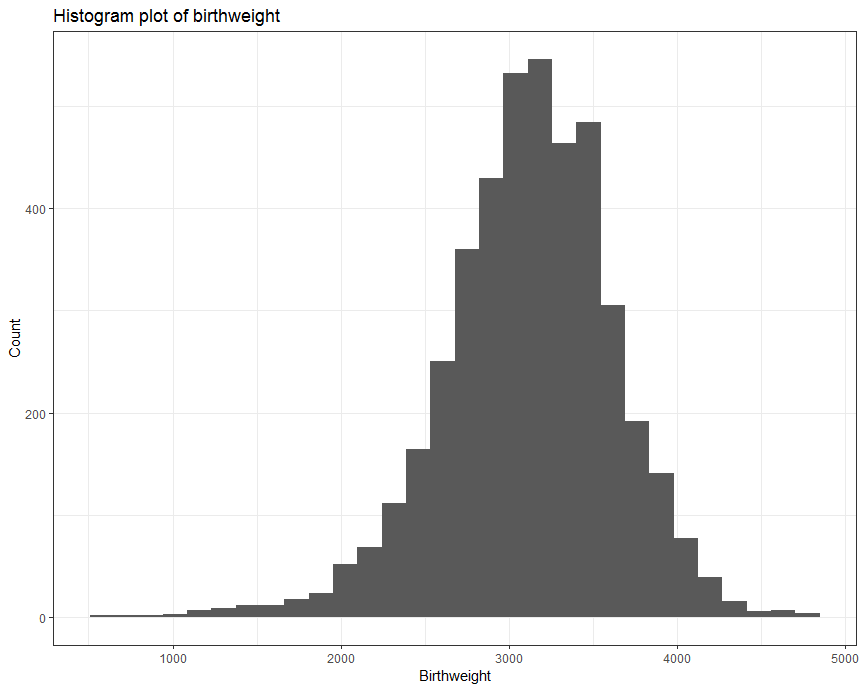
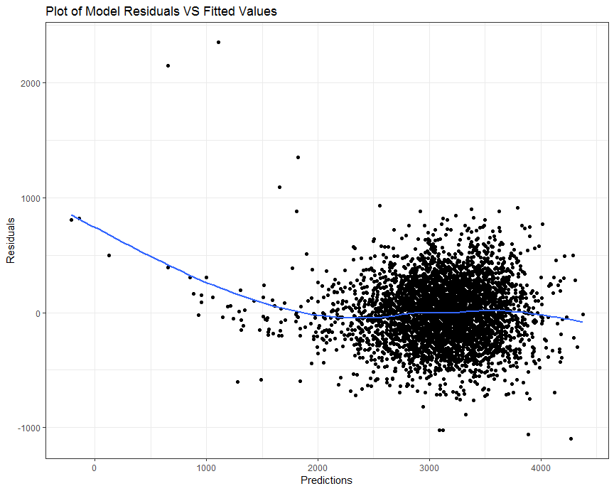

Homework 6
================

Problem 1
---------

### Import and manipulate data

``` r
homicide_df = 
  read_csv("./homicide-data.csv") %>% 
  mutate(city_state = str_c(city, ", ", state),
         resolved = as.numeric(disposition == "Closed by arrest")) %>% 
  filter(!(city_state %in% c("Dallas, TX", "Phoenix, AZ", 
                             "Kansas City, MO", "Tulsa, AL"))) %>% 
  mutate(victim_race = ifelse(victim_race != "White", "Non-White", "White"),
         victim_race = fct_relevel(victim_race, "White"),
         victim_age = as.numeric(victim_age)) %>% 
  select(city_state, resolved, everything())

homicide_df
```

    ## # A tibble: 48,507 x 14
    ##    city_state resolved uid   reported_date victim_last victim_first
    ##    <chr>         <dbl> <chr>         <int> <chr>       <chr>       
    ##  1 Albuquerq~        0 Alb-~      20100504 GARCIA      JUAN        
    ##  2 Albuquerq~        1 Alb-~      20100216 MONTOYA     CAMERON     
    ##  3 Albuquerq~        0 Alb-~      20100601 SATTERFIELD VIVIANA     
    ##  4 Albuquerq~        1 Alb-~      20100101 MENDIOLA    CARLOS      
    ##  5 Albuquerq~        0 Alb-~      20100102 MULA        VIVIAN      
    ##  6 Albuquerq~        0 Alb-~      20100126 BOOK        GERALDINE   
    ##  7 Albuquerq~        1 Alb-~      20100127 MALDONADO   DAVID       
    ##  8 Albuquerq~        1 Alb-~      20100127 MALDONADO   CONNIE      
    ##  9 Albuquerq~        0 Alb-~      20100130 MARTIN-LEY~ GUSTAVO     
    ## 10 Albuquerq~        0 Alb-~      20100210 HERRERA     ISRAEL      
    ## # ... with 48,497 more rows, and 8 more variables: victim_race <fct>,
    ## #   victim_age <dbl>, victim_sex <chr>, city <chr>, state <chr>,
    ## #   lat <dbl>, lon <dbl>, disposition <chr>

``` r
str(homicide_df)
```

    ## Classes 'tbl_df', 'tbl' and 'data.frame':    48507 obs. of  14 variables:
    ##  $ city_state   : chr  "Albuquerque, NM" "Albuquerque, NM" "Albuquerque, NM" "Albuquerque, NM" ...
    ##  $ resolved     : num  0 1 0 1 0 0 1 1 0 0 ...
    ##  $ uid          : chr  "Alb-000001" "Alb-000002" "Alb-000003" "Alb-000004" ...
    ##  $ reported_date: int  20100504 20100216 20100601 20100101 20100102 20100126 20100127 20100127 20100130 20100210 ...
    ##  $ victim_last  : chr  "GARCIA" "MONTOYA" "SATTERFIELD" "MENDIOLA" ...
    ##  $ victim_first : chr  "JUAN" "CAMERON" "VIVIANA" "CARLOS" ...
    ##  $ victim_race  : Factor w/ 2 levels "White","Non-White": 2 2 1 2 1 1 2 2 1 2 ...
    ##  $ victim_age   : num  78 17 15 32 72 91 52 52 56 43 ...
    ##  $ victim_sex   : chr  "Male" "Male" "Female" "Male" ...
    ##  $ city         : chr  "Albuquerque" "Albuquerque" "Albuquerque" "Albuquerque" ...
    ##  $ state        : chr  "NM" "NM" "NM" "NM" ...
    ##  $ lat          : num  35.1 35.1 35.1 35.1 35.1 ...
    ##  $ lon          : num  -107 -107 -107 -107 -107 ...
    ##  $ disposition  : chr  "Closed without arrest" "Closed by arrest" "Closed without arrest" "Closed by arrest" ...

This dataset contains 48507 observations, where each observation is a case of homicide. There are 14 variables in this dataset, including the location of the killing, whether the homicide was solved and basic demographic information about each victim.

### For the city of Baltimore, MD

First, fit a logistic regression with resolved vs unresolved as the outcome and victim age, sex and race as predictors.

``` r
baltimore_df = filter(homicide_df, city == "Baltimore")

fit_logistic = 
  baltimore_df %>% 
  glm(resolved ~ victim_age + victim_sex + victim_race, data = ., family = binomial()) %>% 
  broom::tidy()
fit_logistic
```

    ## # A tibble: 4 x 5
    ##   term                 estimate std.error statistic  p.value
    ##   <chr>                   <dbl>     <dbl>     <dbl>    <dbl>
    ## 1 (Intercept)           1.19      0.235        5.06 4.30e- 7
    ## 2 victim_age           -0.00699   0.00326     -2.14 3.22e- 2
    ## 3 victim_sexMale       -0.888     0.136       -6.53 6.80e-11
    ## 4 victim_raceNon-White -0.820     0.175       -4.69 2.68e- 6

Homicides in which the victim is non-white are substantially less likely to be resolved than those in which the victim is white. Homicides in which the victim is male are significantly less likely to be resolved than those in which the victim is female. The effect of age is statistically significant, but careful data inspections should be conducted before interpreting too deeply.

Then, obtain the estimate and confidence interval of the adjusted odds ratio for solving homicides comparing non-white victims to white victims keeping all other variables fixed:

``` r
fit_logistic %>% 
  filter(term == "victim_raceNon-White") %>% 
  mutate(OR = exp(estimate), 
         lower_limit = exp(estimate - qnorm(0.975)*std.error), 
         upper_limit = exp(estimate + qnorm(0.975)*std.error)) %>% 
  select(term, OR, lower_limit, upper_limit) %>% 
  knitr::kable(digits = 3)
```

| term                  |     OR|  lower\_limit|  upper\_limit|
|:----------------------|------:|-------------:|-------------:|
| victim\_raceNon-White |  0.441|         0.313|          0.62|

The estimate of the adjusted odds ratio for solving homicides comparing non-white victims to white victims keeping all other variables fixed is 0.441 and the 95% confidence interval is (0.313, 0.620).

### For each city

Create a dataframe with estimated ORs and CIs for each city:

``` r
or_df = 
  homicide_df %>% 
  group_by(city_state) %>% 
  nest() %>% 
  mutate(resolved_logistic = 
         map(data, ~glm(resolved ~ victim_age + victim_sex + victim_race, data = ., family = binomial())),
         resolved_logistic = map(resolved_logistic, broom::tidy)) %>% 
  select(city_state, resolved_logistic) %>% 
  unnest() %>% 
  filter(term == "victim_raceNon-White") %>% 
  mutate(OR = exp(estimate), 
         lower_limit = exp(estimate - qnorm(0.975)*std.error), 
         upper_limit = exp(estimate + qnorm(0.975)*std.error)) %>% 
  select(city_state, OR, lower_limit, upper_limit) 
or_df
```

    ## # A tibble: 47 x 4
    ##    city_state         OR lower_limit upper_limit
    ##    <chr>           <dbl>       <dbl>       <dbl>
    ##  1 Albuquerque, NM 0.741      0.451        1.22 
    ##  2 Atlanta, GA     0.753      0.432        1.31 
    ##  3 Baltimore, MD   0.441      0.313        0.620
    ##  4 Baton Rouge, LA 0.668      0.313        1.43 
    ##  5 Birmingham, AL  1.04       0.615        1.76 
    ##  6 Boston, MA      0.115      0.0472       0.278
    ##  7 Buffalo, NY     0.390      0.213        0.714
    ##  8 Charlotte, NC   0.558      0.321        0.969
    ##  9 Chicago, IL     0.562      0.431        0.733
    ## 10 Cincinnati, OH  0.318      0.184        0.551
    ## # ... with 37 more rows

### Odds ratio plot

``` r
or_df %>% 
  mutate(city_state = fct_reorder(city_state, desc(OR))) %>% 
  ggplot(aes(x = city_state, y = OR)) + 
  geom_point() + 
  geom_errorbar(aes(ymin = lower_limit, ymax = upper_limit)) + 
  geom_hline(yintercept = 1, alpha = 0.5, color = "red") +
  coord_flip() +
  labs(title = "Estimated ORs and 95% CIs for solving homicides", 
       y = "Odds ratio for solving homicides", 
       x = "City and State", 
       caption = "Data from the Washington Post") 
```


The above plot shows the estimated ORs and CIs for solving homicides comparing non-white victims to white victims for each city, ordered from most to least. According to the plot, the estimated adjusted OR in most cities for solving homicides comparing non-white to white victims is less than 1, which means in most cities, homicides in which the victim is non-white are less likely to be resolved than those in which the victim is white. Tampa, Florida and Birmingham, Alabama are the only two cities with estimated ORs greater than one, however, both estimates have very wide confidence intervals. In addition, about half of the cities have confidence intervals that include 1.

Problem 2
---------

### Import data

Load and clean the data for regression analysis:

``` r
bwt_data = read_csv("./birthweight.csv")
```

    ## Parsed with column specification:
    ## cols(
    ##   .default = col_integer(),
    ##   gaweeks = col_double(),
    ##   ppbmi = col_double(),
    ##   smoken = col_double()
    ## )

    ## See spec(...) for full column specifications.

``` r
bwt_data =
  bwt_data %>% 
  mutate(babysex = as.factor(recode(babysex, '1' = 'Male', '2' = 'Female')), 
         frace = as.factor(recode(frace, `1` = 'White', `2` = 'Black', 
                               `3` = 'Asian', `4` = 'Puerto Rican', 
                               `8` = 'Other', `9` = 'Unknown')), 
         malform = as.factor(ifelse(malform == 1, "present", "absent")), 
         mrace = as.factor(recode(mrace, `1` = 'White', `2` = 'Black',
                               `3` = 'Asian', `4` = 'Puerto Rican',
                               `8` = 'Other'))) %>% 
  select(bwt, everything())
bwt_data
```

    ## # A tibble: 4,342 x 20
    ##      bwt babysex bhead blength delwt fincome frace gaweeks malform menarche
    ##    <int> <fct>   <int>   <int> <int>   <int> <fct>   <dbl> <fct>      <int>
    ##  1  3629 Female     34      51   177      35 White    39.9 absent        13
    ##  2  3062 Male       34      48   156      65 Black    25.9 absent        14
    ##  3  3345 Female     36      50   148      85 White    39.9 absent        12
    ##  4  3062 Male       34      52   157      55 White    40   absent        14
    ##  5  3374 Female     34      52   156       5 White    41.6 absent        13
    ##  6  3374 Male       33      52   129      55 White    40.7 absent        12
    ##  7  2523 Female     33      46   126      96 Black    40.3 absent        14
    ##  8  2778 Female     33      49   140       5 White    37.4 absent        12
    ##  9  3515 Male       36      52   146      85 White    40.3 absent        11
    ## 10  3459 Male       33      50   169      75 Black    40.7 absent        12
    ## # ... with 4,332 more rows, and 10 more variables: mheight <int>,
    ## #   momage <int>, mrace <fct>, parity <int>, pnumlbw <int>, pnumsga <int>,
    ## #   ppbmi <dbl>, ppwt <int>, smoken <dbl>, wtgain <int>

Check for missing data:

``` r
sum(is.na(bwt_data))
```

    ## [1] 0

This dataset contains 4342 observations with no missing data. I converted numeric to factor where appropriate.

### Model building

Exploratory analyses:

``` r
bwt_data %>% 
  ggplot(aes(x = bwt)) + 
  geom_histogram() + 
  labs(title = "Histogram plot of birthweight",
       x = "Birthweight", 
       y = "Count")
```

    ## `stat_bin()` using `bins = 30`. Pick better value with `binwidth`.



From the histogram plot, baby's birth weight appears to be normally distributed which satisfies the linear regression model assumptions.

Propose a regression model for birthweight:

``` r
mult.fit = lm(bwt ~ ., data = bwt_data)
step(mult.fit, direction = 'backward')
```

    ## Start:  AIC=48717.83
    ## bwt ~ babysex + bhead + blength + delwt + fincome + frace + gaweeks + 
    ##     malform + menarche + mheight + momage + mrace + parity + 
    ##     pnumlbw + pnumsga + ppbmi + ppwt + smoken + wtgain
    ## 
    ## 
    ## Step:  AIC=48717.83
    ## bwt ~ babysex + bhead + blength + delwt + fincome + frace + gaweeks + 
    ##     malform + menarche + mheight + momage + mrace + parity + 
    ##     pnumlbw + pnumsga + ppbmi + ppwt + smoken
    ## 
    ## 
    ## Step:  AIC=48717.83
    ## bwt ~ babysex + bhead + blength + delwt + fincome + frace + gaweeks + 
    ##     malform + menarche + mheight + momage + mrace + parity + 
    ##     pnumlbw + ppbmi + ppwt + smoken
    ## 
    ## 
    ## Step:  AIC=48717.83
    ## bwt ~ babysex + bhead + blength + delwt + fincome + frace + gaweeks + 
    ##     malform + menarche + mheight + momage + mrace + parity + 
    ##     ppbmi + ppwt + smoken
    ## 
    ##            Df Sum of Sq       RSS   AIC
    ## - frace     4    124365 320848704 48712
    ## - malform   1      1419 320725757 48716
    ## - ppbmi     1      6346 320730684 48716
    ## - momage    1     28661 320752999 48716
    ## - mheight   1     66886 320791224 48717
    ## - menarche  1    111679 320836018 48717
    ## - ppwt      1    131132 320855470 48718
    ## <none>                  320724338 48718
    ## - fincome   1    193454 320917792 48718
    ## - parity    1    413584 321137922 48721
    ## - mrace     3    868321 321592659 48724
    ## - babysex   1    853796 321578134 48727
    ## - gaweeks   1   4611823 325336161 48778
    ## - smoken    1   5076393 325800732 48784
    ## - delwt     1   8008891 328733230 48823
    ## - blength   1 102050296 422774634 49915
    ## - bhead     1 106535716 427260054 49961
    ## 
    ## Step:  AIC=48711.51
    ## bwt ~ babysex + bhead + blength + delwt + fincome + gaweeks + 
    ##     malform + menarche + mheight + momage + mrace + parity + 
    ##     ppbmi + ppwt + smoken
    ## 
    ##            Df Sum of Sq       RSS   AIC
    ## - malform   1      1447 320850151 48710
    ## - ppbmi     1      6975 320855679 48710
    ## - momage    1     28379 320877083 48710
    ## - mheight   1     69502 320918206 48710
    ## - menarche  1    115708 320964411 48711
    ## - ppwt      1    133961 320982665 48711
    ## <none>                  320848704 48712
    ## - fincome   1    194405 321043108 48712
    ## - parity    1    414687 321263390 48715
    ## - babysex   1    852133 321700837 48721
    ## - gaweeks   1   4625208 325473911 48772
    ## - smoken    1   5036389 325885093 48777
    ## - delwt     1   8013099 328861802 48817
    ## - mrace     3  13540415 334389119 48885
    ## - blength   1 101995688 422844392 49908
    ## - bhead     1 106662962 427511666 49956
    ## 
    ## Step:  AIC=48709.53
    ## bwt ~ babysex + bhead + blength + delwt + fincome + gaweeks + 
    ##     menarche + mheight + momage + mrace + parity + ppbmi + ppwt + 
    ##     smoken
    ## 
    ##            Df Sum of Sq       RSS   AIC
    ## - ppbmi     1      6928 320857079 48708
    ## - momage    1     28660 320878811 48708
    ## - mheight   1     69320 320919470 48708
    ## - menarche  1    116027 320966177 48709
    ## - ppwt      1    133894 320984044 48709
    ## <none>                  320850151 48710
    ## - fincome   1    193784 321043934 48710
    ## - parity    1    414482 321264633 48713
    ## - babysex   1    851279 321701430 48719
    ## - gaweeks   1   4624003 325474154 48770
    ## - smoken    1   5035195 325885346 48775
    ## - delwt     1   8029079 328879230 48815
    ## - mrace     3  13553320 334403471 48883
    ## - blength   1 102009225 422859375 49906
    ## - bhead     1 106675331 427525481 49954
    ## 
    ## Step:  AIC=48707.63
    ## bwt ~ babysex + bhead + blength + delwt + fincome + gaweeks + 
    ##     menarche + mheight + momage + mrace + parity + ppwt + smoken
    ## 
    ##            Df Sum of Sq       RSS   AIC
    ## - momage    1     29211 320886290 48706
    ## - menarche  1    117635 320974714 48707
    ## <none>                  320857079 48708
    ## - fincome   1    195199 321052278 48708
    ## - parity    1    412984 321270064 48711
    ## - babysex   1    850020 321707099 48717
    ## - mheight   1   1078673 321935752 48720
    ## - ppwt      1   2934023 323791103 48745
    ## - gaweeks   1   4621504 325478583 48768
    ## - smoken    1   5039368 325896447 48773
    ## - delwt     1   8024939 328882018 48813
    ## - mrace     3  13551444 334408523 48881
    ## - blength   1 102018559 422875638 49904
    ## - bhead     1 106821342 427678421 49953
    ## 
    ## Step:  AIC=48706.02
    ## bwt ~ babysex + bhead + blength + delwt + fincome + gaweeks + 
    ##     menarche + mheight + mrace + parity + ppwt + smoken
    ## 
    ##            Df Sum of Sq       RSS   AIC
    ## - menarche  1    100121 320986412 48705
    ## <none>                  320886290 48706
    ## - fincome   1    240800 321127090 48707
    ## - parity    1    431433 321317724 48710
    ## - babysex   1    841278 321727568 48715
    ## - mheight   1   1076739 321963029 48719
    ## - ppwt      1   2913653 323799943 48743
    ## - gaweeks   1   4676469 325562760 48767
    ## - smoken    1   5045104 325931394 48772
    ## - delwt     1   8000672 328886962 48811
    ## - mrace     3  14667730 335554021 48894
    ## - blength   1 101990556 422876847 49902
    ## - bhead     1 106864308 427750598 49952
    ## 
    ## Step:  AIC=48705.38
    ## bwt ~ babysex + bhead + blength + delwt + fincome + gaweeks + 
    ##     mheight + mrace + parity + ppwt + smoken
    ## 
    ##           Df Sum of Sq       RSS   AIC
    ## <none>                 320986412 48705
    ## - fincome  1    245637 321232048 48707
    ## - parity   1    422770 321409181 48709
    ## - babysex  1    846134 321832545 48715
    ## - mheight  1   1012240 321998651 48717
    ## - ppwt     1   2907049 323893461 48743
    ## - gaweeks  1   4662501 325648912 48766
    ## - smoken   1   5073849 326060260 48771
    ## - delwt    1   8137459 329123871 48812
    ## - mrace    3  14683609 335670021 48894
    ## - blength  1 102191779 423178191 49903
    ## - bhead    1 106779754 427766166 49950

    ## 
    ## Call:
    ## lm(formula = bwt ~ babysex + bhead + blength + delwt + fincome + 
    ##     gaweeks + mheight + mrace + parity + ppwt + smoken, data = bwt_data)
    ## 
    ## Coefficients:
    ##       (Intercept)        babysexMale              bhead  
    ##         -6145.151            -28.558            130.777  
    ##           blength              delwt            fincome  
    ##            74.947              4.107              0.318  
    ##           gaweeks            mheight         mraceBlack  
    ##            11.592              6.594            -63.906  
    ## mracePuerto Rican         mraceWhite             parity  
    ##           -25.791             74.887             96.305  
    ##              ppwt             smoken  
    ##            -2.676             -4.843

``` r
model_my = lm(bwt ~ babysex + bhead + blength + delwt + fincome + 
              gaweeks + mheight + mrace + parity + ppwt + smoken, data = bwt_data)
summary(model_my)
```

    ## 
    ## Call:
    ## lm(formula = bwt ~ babysex + bhead + blength + delwt + fincome + 
    ##     gaweeks + mheight + mrace + parity + ppwt + smoken, data = bwt_data)
    ## 
    ## Residuals:
    ##      Min       1Q   Median       3Q      Max 
    ## -1097.18  -185.52    -3.39   174.14  2353.44 
    ## 
    ## Coefficients:
    ##                     Estimate Std. Error t value Pr(>|t|)    
    ## (Intercept)       -6145.1507   141.9496 -43.291  < 2e-16 ***
    ## babysexMale         -28.5580     8.4549  -3.378 0.000737 ***
    ## bhead               130.7770     3.4466  37.944  < 2e-16 ***
    ## blength              74.9471     2.0190  37.120  < 2e-16 ***
    ## delwt                 4.1067     0.3921  10.475  < 2e-16 ***
    ## fincome               0.3180     0.1747   1.820 0.068844 .  
    ## gaweeks              11.5925     1.4621   7.929 2.79e-15 ***
    ## mheight               6.5940     1.7849   3.694 0.000223 ***
    ## mraceBlack          -63.9057    42.3663  -1.508 0.131523    
    ## mracePuerto Rican   -25.7914    45.3502  -0.569 0.569578    
    ## mraceWhite           74.8868    42.3146   1.770 0.076837 .  
    ## parity               96.3047    40.3362   2.388 0.017004 *  
    ## ppwt                 -2.6756     0.4274  -6.261 4.20e-10 ***
    ## smoken               -4.8434     0.5856  -8.271  < 2e-16 ***
    ## ---
    ## Signif. codes:  0 '***' 0.001 '**' 0.01 '*' 0.05 '.' 0.1 ' ' 1
    ## 
    ## Residual standard error: 272.3 on 4328 degrees of freedom
    ## Multiple R-squared:  0.7181, Adjusted R-squared:  0.7173 
    ## F-statistic: 848.1 on 13 and 4328 DF,  p-value: < 2.2e-16

*Description of my modeling process:* First, I checked the distribution of the outcome -- birth weight and it turned out to be normally distributed, so I decided to build a linear regression model. Then I used stepwise regression procedure to select variables and a single regression model is identified as the 'best' model in the end of the stepwise regression. 'Step' function uses AIC criterion for variable selection and the default option is 'backward'. I picked the final model as my model, which includes 11 predictors -- baby's sex, baby's head circumference at birth (centimeters), baby's length at birth (centimeteres), mother's weight at delivery (pounds), family monthly income (in hundreds, rounded), gestational age in weeks, mother's height (inches), mother's race, number of live births prior to this pregnancy, mother's pre-pregnancy weight (pounds), and average number of cigarettes smoked per day during pregnancy.

Show a plot of model residuals against fitted values:

``` r
bwt_data %>% 
  add_predictions(model_my) %>% 
  add_residuals(model_my) %>% 
  ggplot(aes(x = pred, y = resid)) +
  geom_point() +
  geom_smooth(se = FALSE) +
  labs(
        title = "Plot of Model Residuals VS Fitted Values",
        x = "Predictions",
        y = "Residuals"
      ) 
```

    ## `geom_smooth()` using method = 'gam' and formula 'y ~ s(x, bs = "cs")'



The above scatter plot shows the relationship between predicted values and residuals for the my model. It appears that the equality of variance assumption is not holding when the predicted values of birth weight are very low and that outliers are present. However, for most observatons, residuals form a horizontal (linear) band around zero, which indicates equal variance.
